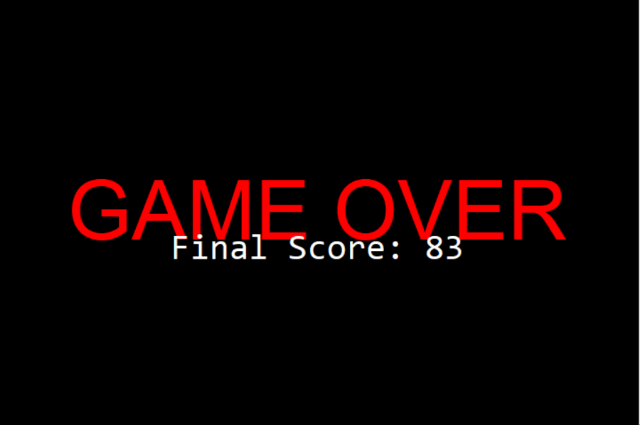

# Snake Eater Game

Welcome to the **Snake Eater** game, a classic snake game implemented in Python using Tkinter for the graphical interface. In this game, you control a snake that grows longer as it eats food, including special food for bonus points!

## Preview
Here’s a preview of the game in action:


### Screenshots

*Start Screen*


*Gameplay in progress*


*Game Over Screen*

## Table of Contents
- [Preview](#preview)
- [Features](#features)
- [Installation](#installation)
- [How to Play](#how-to-play)
- [Game Controls](#game-controls)
- [Code Structure](#code-structure)
- [Contributing](#contributing)
- [License](#license)

## Features
- Classic snake gameplay with a growing snake.
- Regular food that increases the score.
- Special food that grants bonus points.
- Game over screen with the final score.
- Restart option to play again.

## Installation
1. Ensure you have Python installed on your computer. You can download it from [python.org](https://www.python.org/downloads/).
2. If Tkinter is not installed, you can install it using `pip`:
   ```bash
   pip install tk
   ```
3. Download or clone this repository to your local machine.
4. Navigate to the project directory in your terminal.
5. Run the game using the following command:
   ```bash
   python snake.py
   ```

## How to Play
- Use the arrow keys (or `WASD`) to control the direction of the snake.
- Eat the white food to grow the snake and increase your score.
- Special red food appears occasionally, providing extra points when eaten.
- Avoid colliding with the snake's own body.

## Game Controls
- **Arrow Keys**: Control the snake (Up, Down, Left, Right).
- **WASD Keys**: Alternative controls (W = Up, A = Left, S = Down, D = Right).
- **Restart Button**: Click to restart the game after a game over.

## Code Structure
- `Snake` Class: Manages the snake's properties and behavior.
- `Food` Class: Handles the placement and management of food items.
- Main game loop: Controls the game state, including movement and collisions.

## Contributing
Contributions are welcome! If you find any issues or would like to add features, feel free to open an issue or submit a pull request.

## License
This project is licensed under the MIT License - see the [LICENSE](LICENSE) file for details.

---

Enjoy playing Snake Eater!
